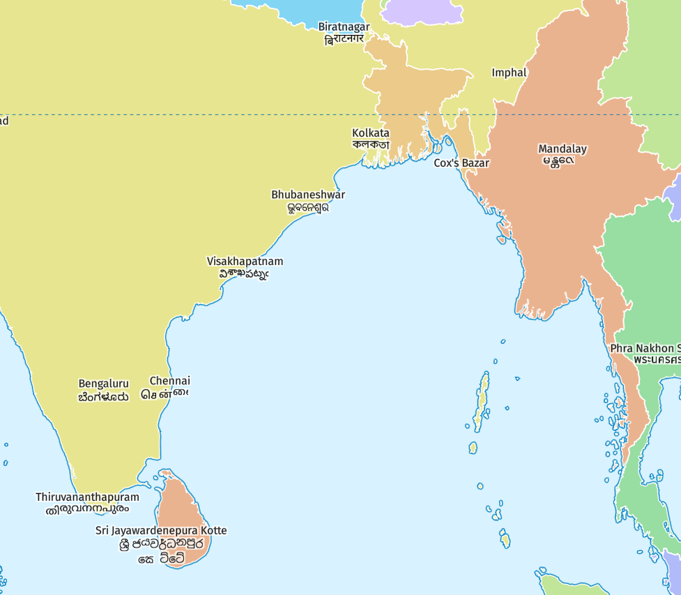

# maplibre-indexed-font
Use an indexed font in MapLibre to render non-supported scripts

## Idea

This is an extension from previous work on [index-by-grapheme](https://github.com/maplibre/maplibre-gl-js/pull/2458). The idea is to cut label strings into segments that are visually independent. Then store one glyph for every segment in an indexed-font. Replace the segments with the index of the segment. Sorry for the bad explanation, but it is a good idea I think...

Works with any version of MapLibre. No modification of the codebase or toolkit is needed.

## Demo

<a href="https://wipfli.github.io/maplibre-indexed-font/#map=4.65/15.48/87.62"></a>

## Usage

To get the sdf_font_tool submodule, run:

```
git submodule update --init
```

Assume you have a `segments.txt` file with the text segments that should be used as font characters.

To generate the SDF glyphs with TinySDF, run:

```
cd tinysdf
npm install
npm run main
```

This creates `glyphs.json`.

Then to bundle the glyphs into a MapLibre font glyph range, run:

```
cd sdf_font_tools
./run.sh
```

This uses the glyphs stored in `glyphs.json` and it uses a normal `roboto.ttf` font for the usual characters. The output is stored in the `indexed-font` directory.

The labels are stored in `tests.geojson`. Encode them to use the indexed-font codepoints from the `segments.txt` file with:

```
python3 encode_tests.py
```


